# LCMS Data Dashboard

Interactive dashboard for **Lutheran Church—Missouri Synod (LCMS)** congregation
statistics in the United States. Every chart, table, and lookup is rendered live
from a bundled SQLite database (`data/lcms.db`) — no scraper or build pipeline
required.

The bundled snapshot (captured **2026‑05‑28**) covers **5,986 congregations**
across **all 35 LCMS districts**, with up to 10 years of membership, worship,
and financial history per church.

LIVE DEMO: https://lcms-dashboard.onrender.com/
Give the page a solid 30 seconds for the service to spin up.

## Quick start

```bash
git clone https://github.com/andystumpf/lcms-data-dashboard.git
cd lcms-data-dashboard
npm install
npm start
```

Open [http://localhost:8000](http://localhost:8000)

Or: `bash start.sh`

> The dashboard reads **only** from `data/lcms.db` at runtime via `/api/lcms`.
> There is no placeholder or illustrative data — if the server is not running,
> pages render an empty state.

## Pages at a glance

| URL | Description |
|-----|-------------|
| `/index.html` | Main dashboard — KPIs, key indicators, Top 50 rankings, national trends, district breakdowns, the 36‑chart "Ten‑Year Story", a league table, and a per‑church lookup |
| `/compare.html` | Compare 2–10 congregations side by side |
| `/sql.html` | Read‑only SQL console against `data/lcms.db` |

---

# Guided tour

All screenshots below are captured from the live server against the bundled
database. To regenerate them after a data refresh, run
[`tools/capture-screenshots.mjs`](tools/capture-screenshots.mjs) (see
[Regenerating screenshots](#regenerating-screenshots)).

## 1 · Dashboard (`/index.html`)

### Header, search & headline KPIs

The sticky header carries the **District** and **Period** filters that drive the
entire Key Indicators section. Below it, a global church search bar and four
headline KPI cards summarize the active selection: active congregations,
baptized members, average weekly attendance, and total annual giving — each with
a change indicator versus the start of the selected period.

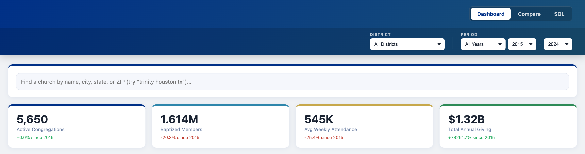

### Key Indicators

Four filter‑aware charts react instantly to the District and Period selectors:

- **Indexed Trajectory** — all four headline KPIs normalized to `period start = 100` for shape‑over‑size comparison.
- **Change Over Selected Period** — percent change from the first to last year of the active window.
- **Members per Congregation** — average baptized membership per active church.
- **District Share of Congregations** — top‑10 districts vs. all others.

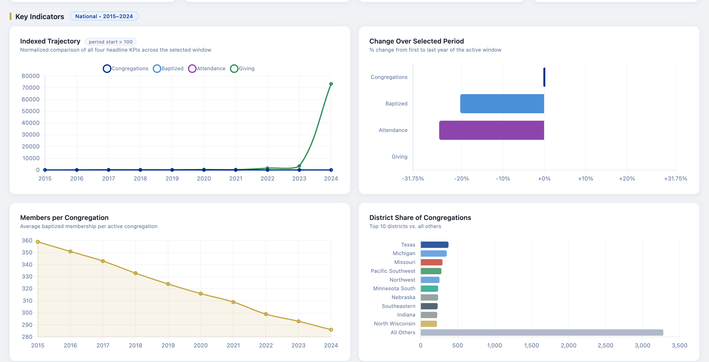

### Top 50 rankings

A hero bar chart ranking individual congregations, color‑coded by district.
Tabs instantly re‑rank by **Attendance**, **Baptized**, **Communing**,
**Total Giving**, **$/Member**, or **Confirmations**. A sortable detail table
sits directly beneath it.

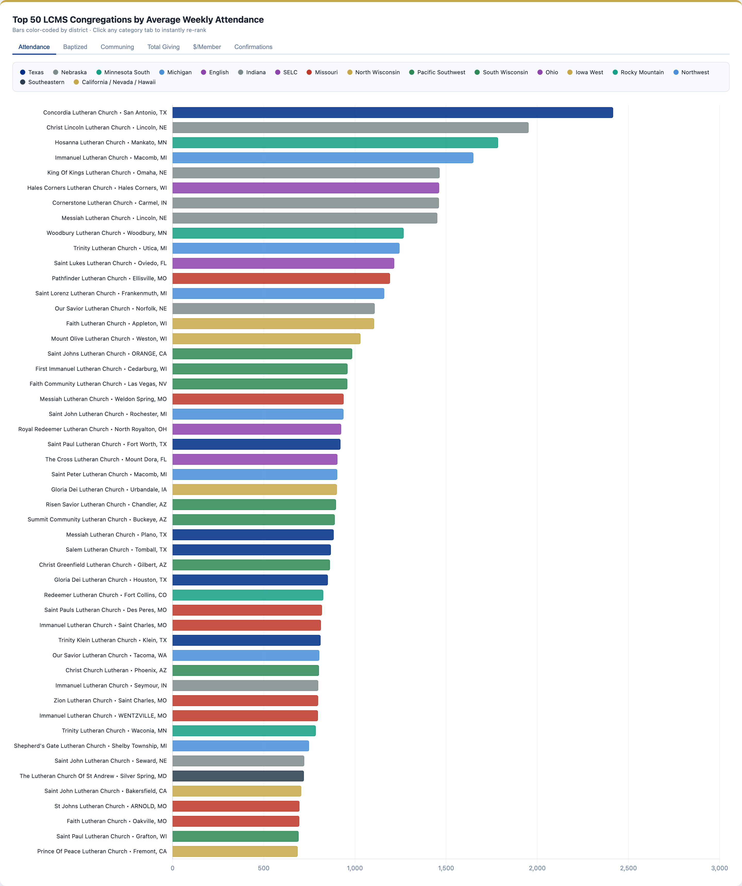

### National trends

Six charts tracking the synod over time: membership (baptized & communing),
average weekly attendance, total annual giving, a contributions‑vs‑expenses
breakdown, baptisms & confirmations, congregation‑size distribution, per‑member
giving, worship attendance rate, top states by church count, and net membership
flow.

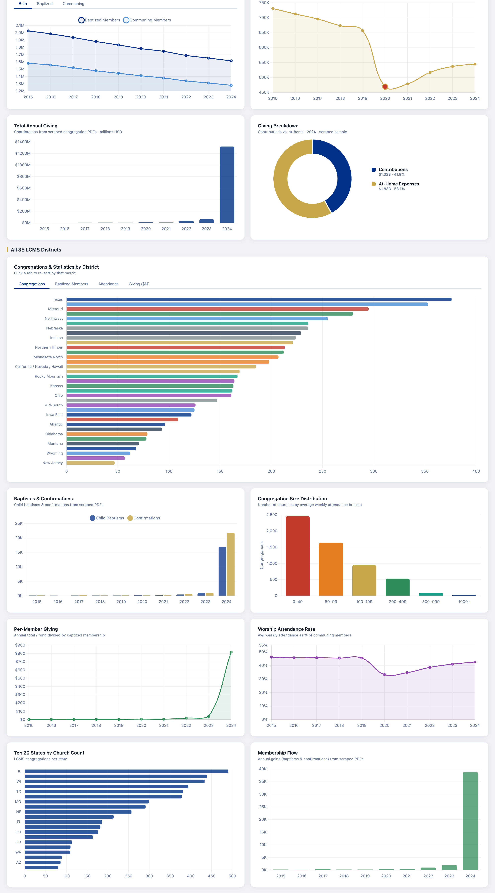

### Congregations by district

A re‑sortable horizontal bar chart covering all 35 districts. Tabs switch the
sort metric between **Congregations**, **Baptized Members**, **Attendance**, and
**Giving ($M)**.

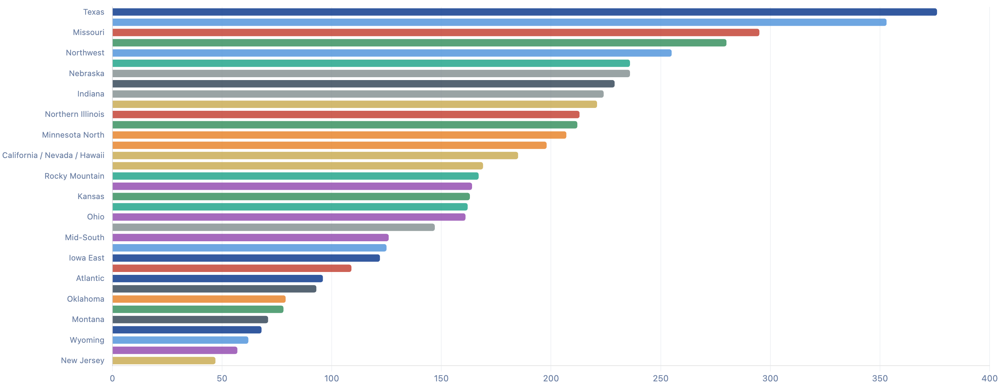

### Ten‑Year Story

A 36‑chart investigative section (sample shown) grouped into themes —
membership & retention, worship, giving, and congregation health — all driven by
the active Period filter.

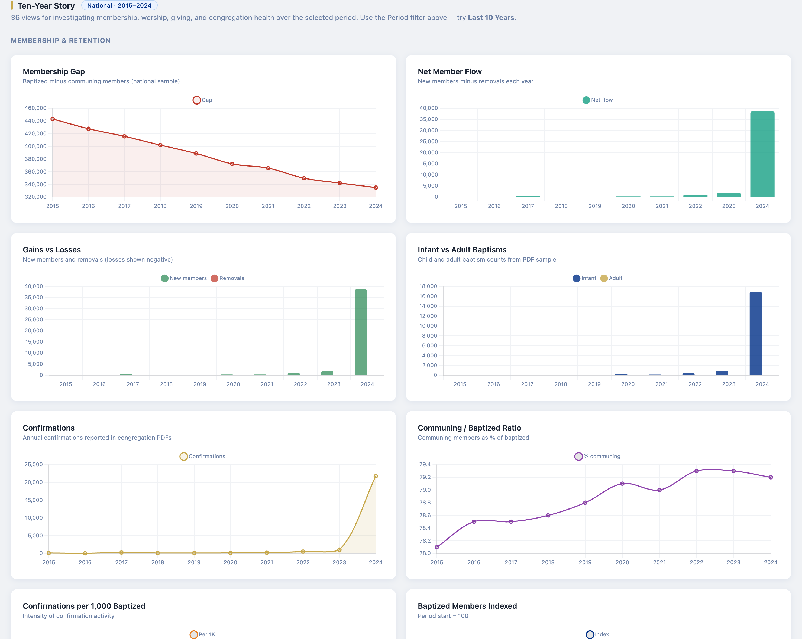

### District League Table

Every district ranked by congregation count, showing churches, baptized and
communing members, average weekly attendance, annual giving, and giving per
member for the most recent reporting year.

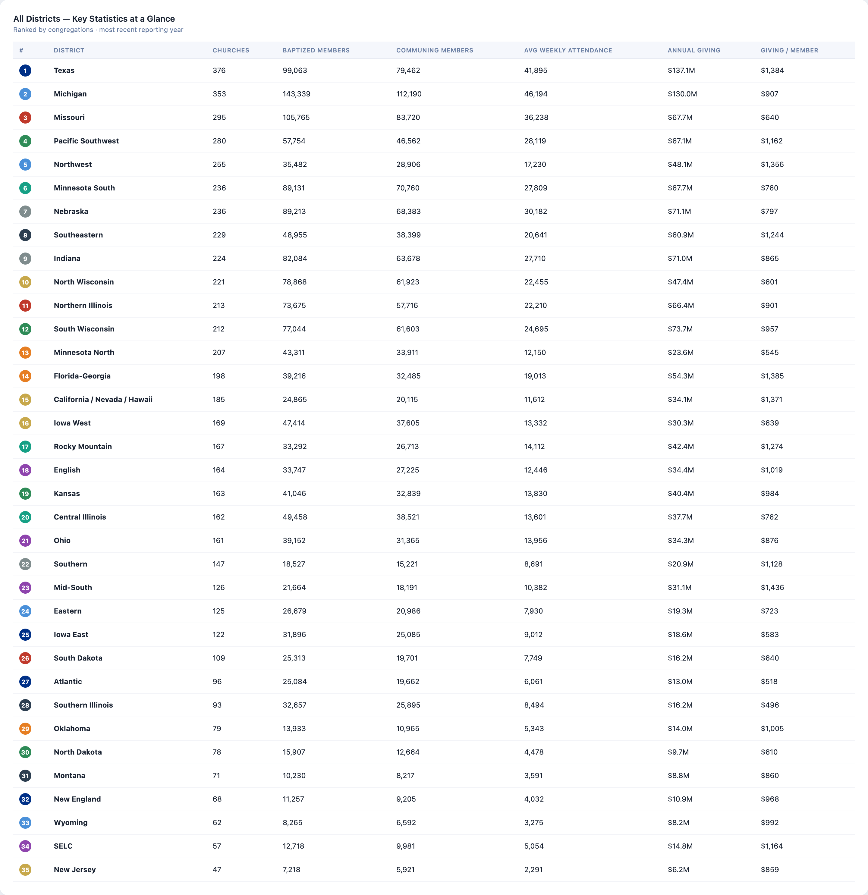

### Church lookup

Type‑ahead search across all 5,986 congregations by name, city, state, or ZIP.

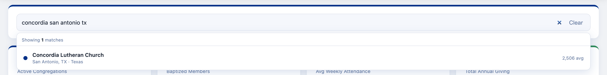

Selecting a result opens a full profile: headline stats, a 10‑year trend chart,
a "this congregation vs. similar churches" comparison, plus schools, ministries,
and service times, with deep links to the LCMS Locator and the source stats PDF.

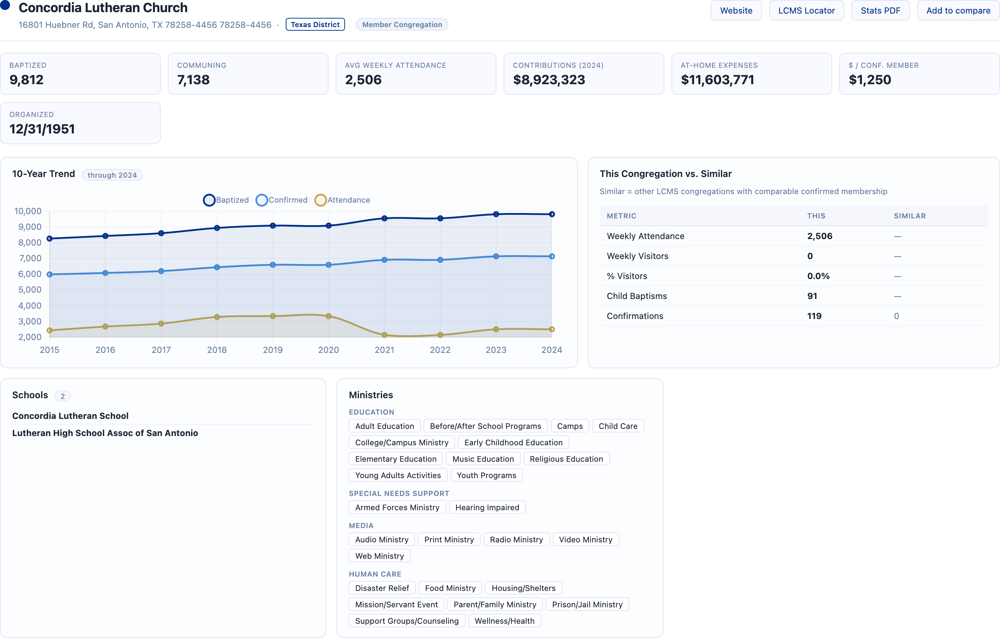

## 2 · Compare (`/compare.html`)

Select **2–10 congregations** (by search, or via the `?cids=` URL parameter) and
compare them side by side. A metrics table lines up every statistic, and an
overlaid 10‑year trend chart switches between baptized, attendance, and
confirmed.

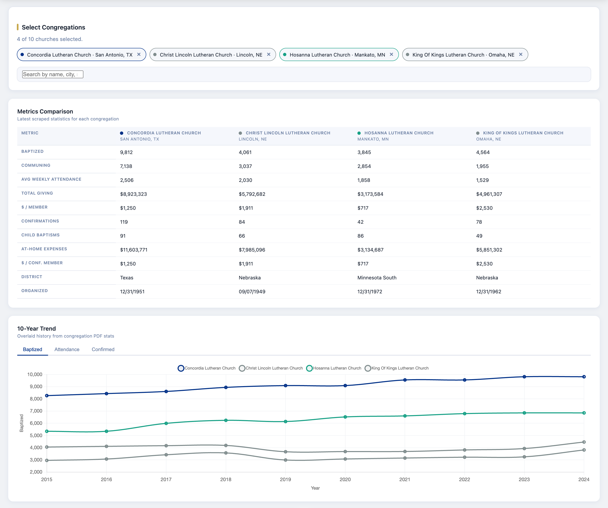

Five analytical charts round out the comparison: **Indexed Trend** (growth pace
regardless of size), **10‑Year % Change**, a normalized **Profile Radar**,
**Worship Reach** (attendance as a share of membership), and a **Financial
Snapshot** of contributions vs. at‑home expenses.

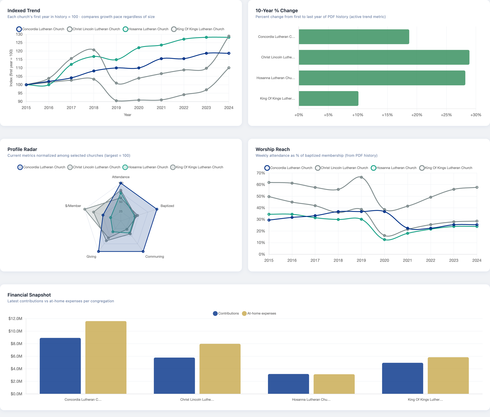

## 3 · SQL console (`/sql.html`)

A read‑only SQL workbench over `data/lcms.db`. Write a `SELECT`, run it with the
button or `Ctrl/⌘ + Enter`, sort result columns by clicking headers, and export
to CSV. Queries can be saved and reloaded by category.

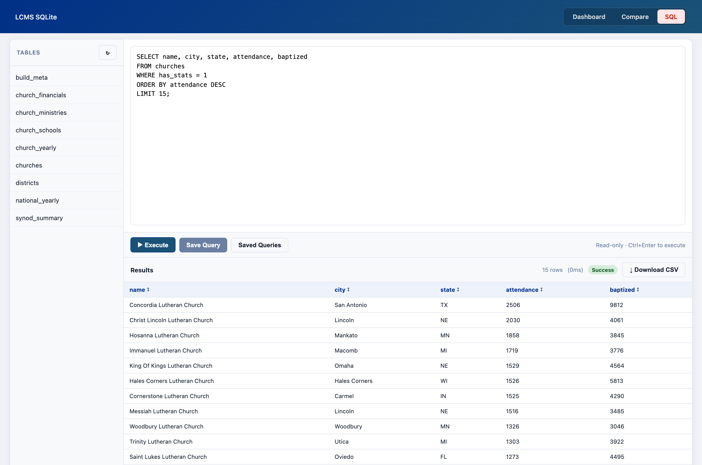

The sidebar lists every table; click one to expand its columns and types, or use
the `+` button to insert a name into the editor.

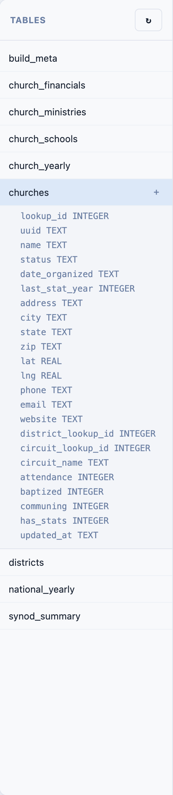

---

## API

| Endpoint | Description |
|----------|-------------|
| `GET /api/lcms` | Full dashboard payload (churches, districts, national yearly series) |
| `GET /api/health` | `{ ok, source, db, fetchedAt, churches, districts }` |
| `POST /api/sql/execute` | Run a read‑only `SELECT` (SQL console) |
| `GET /api/sql/tables` | List tables |
| `GET /api/sql/tables/:name/columns` | List a table's columns |
| `GET /api/sql/saved` · `POST /api/sql/saved` · `PUT/DELETE /api/sql/saved/:id` | Manage saved queries |

Example:

```bash
curl http://localhost:8000/api/health
# {"ok":true,"source":"sqlite","churches":5986,"districts":35,...}
```

Environment variables:

- `LCMS_PORT` — default `8000`
- `LCMS_DB_PATH` — default `data/lcms.db`

## Data model

The SQLite database holds nine tables:

| Table | Contents |
|-------|----------|
| `churches` | One row per congregation (location, contact, latest stats) |
| `church_yearly` | Per‑church annual membership/worship history |
| `church_financials` | Per‑church giving & expense history |
| `church_ministries` · `church_schools` | Programs and schools per congregation |
| `districts` | District metadata |
| `national_yearly` · `synod_summary` | Synod‑wide aggregates |
| `build_meta` | Snapshot provenance |

Schema reference: [`db/schema.sql`](db/schema.sql), [`db/views.sql`](db/views.sql)

## Regenerating screenshots

The images in `docs/screenshots/` are produced by a headless‑Chrome script that
drives the live server. With the server running:

```bash
npm start &                          # start the dashboard on :8000
node tools/capture-screenshots.mjs   # writes docs/screenshots/*.png
```

Requirements: Google Chrome installed (override with `CHROME_PATH`) and
`puppeteer-core` available (`npm install puppeteer-core`). Override the target
with `BASE_URL`.

## License

Data originates from [locator.lcms.org](https://locator.lcms.org). Use in
accordance with LCMS terms and applicable privacy guidelines.
